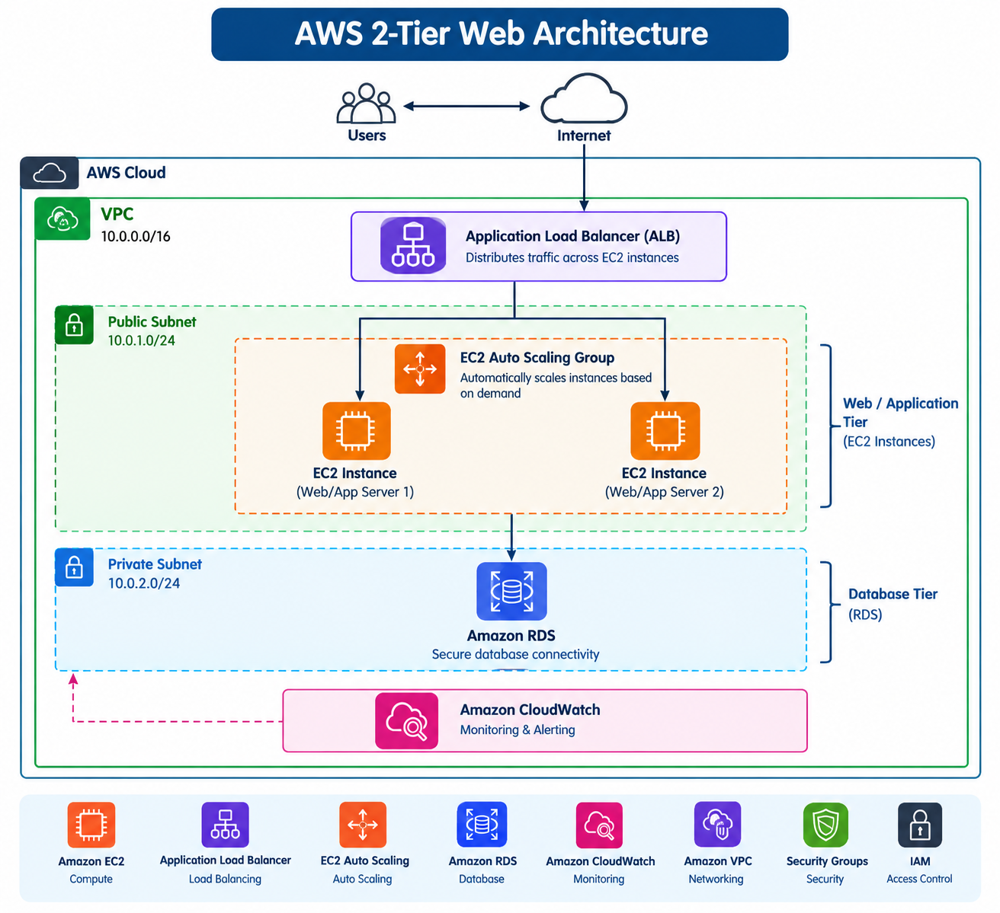

# AWS 2-Tier Web Architecture

## Project Overview

This project demonstrates the design and implementation of a scalable 2-tier web architecture using AWS services.

The architecture includes a web/application layer and a database layer, with load balancing, auto-scaling, secure database connectivity, and monitoring configured using AWS services.

## AWS Services Used

- Amazon EC2
- Elastic Load Balancing (ELB)
- Auto Scaling
- Amazon RDS
- Amazon CloudWatch
- Amazon VPC
- IAM
- Security Groups

## Project Implementation

1. Designed a 2-tier web architecture using AWS.
2. Configured Amazon EC2 instances for the web/application layer.
3. Configured Elastic Load Balancing to distribute incoming traffic.
4. Configured Auto Scaling to automatically adjust EC2 capacity.
5. Implemented secure database connectivity using Amazon RDS.
6. Configured Amazon VPC and Security Groups for network security.
7. Set up monitoring and alerting using Amazon CloudWatch.
8. Tested the architecture and verified connectivity between the application and database layers.

## Architecture

[AWS 2-Tier Web Architecture](https://github.com/Sumishasunilt/aws-2-tier-web-architecture/blob/main/architecture.png)

## Project Flow

User / Browser → Load Balancer → EC2 Instances → Amazon RDS

The Load Balancer distributes incoming traffic across EC2 instances. Auto Scaling manages the number of EC2 instances based on demand, while Amazon RDS provides the database layer. CloudWatch is used for monitoring and alerting.

## Skills Demonstrated

- AWS Cloud Architecture
- Amazon EC2
- Elastic Load Balancing
- Auto Scaling
- Amazon RDS
- Amazon CloudWatch
- Amazon VPC
- Security Groups
- IAM
- Cloud Infrastructure
- Monitoring and Troubleshooting

## Project Outcome

- Successfully designed a scalable 2-tier web architecture.
- Configured load balancing for traffic distribution.
- Implemented Auto Scaling for application availability and scalability.
- Configured secure connectivity with Amazon RDS.
- Set up CloudWatch monitoring and alerting.
- Practiced AWS networking, security, and infrastructure configuration.
